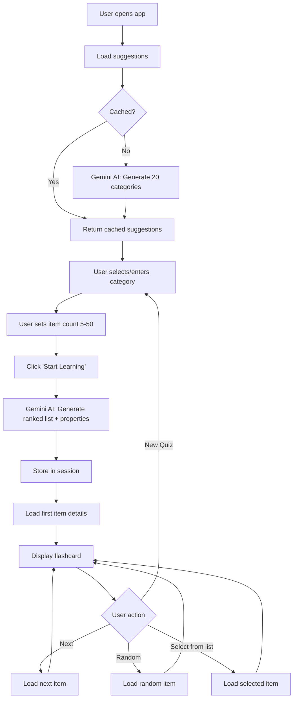
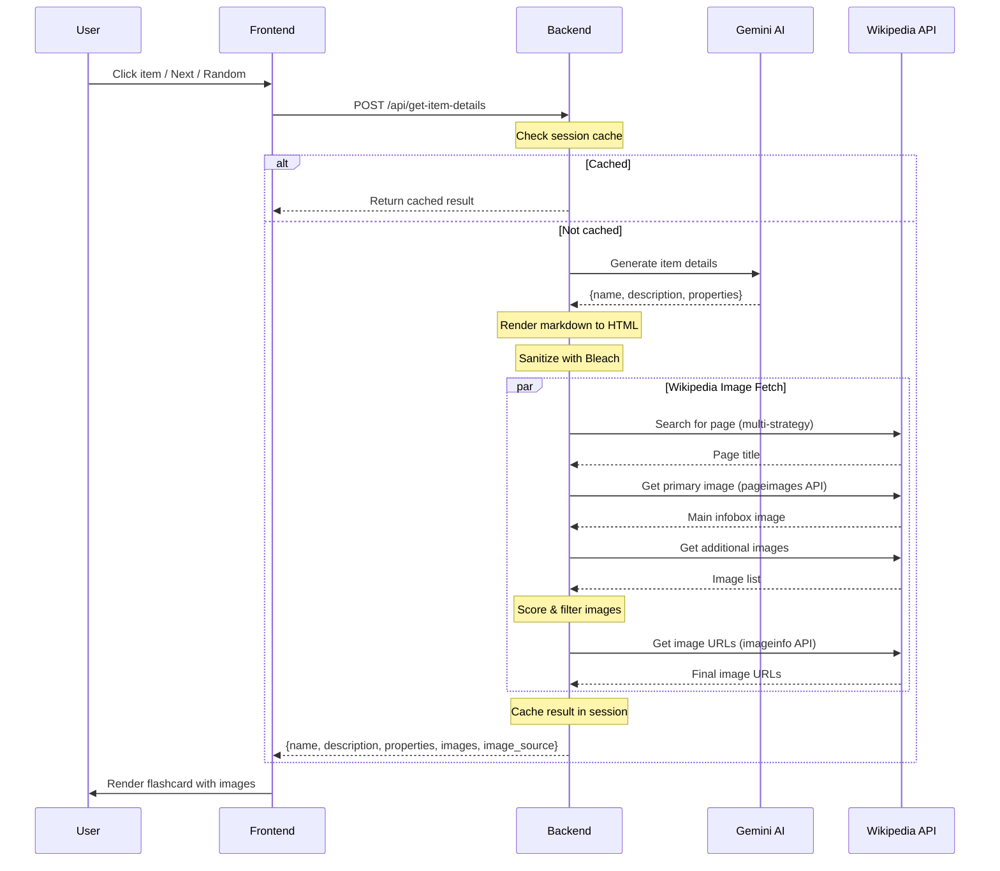

# Top of the Pops

An AI-powered visual learning application that helps users study ranked lists across various categories using generative AI and Wikipedia imagery.

## Features

- **Dynamic Quiz Generation**: Select any category (movie stars, car brands, Nobel Prize winners, etc.) and specify how many items to study (5-50)
- **AI-Generated Content**: Uses Google's Gemini 2.0 Flash model to create ranked lists with contextually relevant properties
- **Visual Flashcards**: Displays items with up to 3 images fetched from Wikipedia, descriptions, and structured facts
- **Interactive Navigation**: Browse items sequentially, randomly, or via an item list modal
- **Smart Image Selection**: Intelligent Wikipedia image fetching with category-aware disambiguation
- **Session Caching**: Caches item details per session for performance
- **AI Category Suggestions**: Provides 20 diverse category ideas on the home screen
- **Markdown Rendering**: AI-generated content rendered with proper formatting (bold, italics, lists)
- **Wikipedia Attribution**: Shows source page and links to Wikipedia for further reading

## Tech Stack

### Backend
- **Framework**: Flask 3.0.0
- **AI**: Google Generative AI (Gemini 2.0 Flash)
- **External APIs**: Wikipedia API
- **Content Processing**: Markdown + Bleach (server-side rendering with HTML sanitization)
- **Runtime**: Python 3.11

### Frontend
- **Styling**: Tailwind CSS (CDN)
- **Reactivity**: Alpine.js 3.x
- **Fonts**: Righteous (display), Space Mono (monospace)
- **Design**: Retro 80s/90s aesthetic

### Deployment
- **Containerization**: Docker (python:3.11-slim)
- **Server**: Gunicorn
- **Platform**: Google Cloud Run

## Architecture

```
popquiz/
├── app.py                  # Flask backend with AI and Wikipedia integration
├── requirements.txt        # Python dependencies
├── .env                    # Environment config (GOOGLE_AI_STUDIO_KEY)
├── Dockerfile              # Cloud Run deployment config
├── templates/
│   └── index.html          # Single-page application
└── static/
    └── app.js              # Alpine.js frontend logic
```

**Pattern**: Monolithic Flask app with a single-page frontend. Session state stored server-side with unique session IDs.

### Quiz Flow



### Item Detail Query Flow



### Wikipedia Image Algorithm

The app uses a multi-stage algorithm to fetch relevant images from Wikipedia:

**1. Page Discovery (Disambiguation)**

Finding the right Wikipedia page is critical—searching "Prince" could return the musician, a royal title, or dozens of other pages. The algorithm uses multiple search strategies:

- **Exact match**: Try the item name directly (e.g., "The Beatles")
- **Disambiguation suffixes**: Based on category, try suffixes like "Prince (musician)" or "Queen (band)"
- **Category-enhanced**: Fall back to searching "Prince 80s rock bands"
- **Disambiguation resolution**: If a disambiguation page is hit, scan results for the best match

Category hints are derived from keywords:
- Music categories → `(musician)`, `(band)`, `(singer)`
- Film categories → `(actor)`, `(actress)`, `(film)`
- Sports categories → `(athlete)`, `(sportsperson)`
- Science categories → `(scientist)`, `(physicist)`
- Political categories → `(politician)`, `(leader)`

**2. Primary Image Extraction**

The Wikipedia `pageimages` API returns the main infobox/thumbnail image—this is almost always the most relevant image and is fetched first.

**3. Additional Image Scoring**

For pages with multiple images, each candidate is scored:

| Factor | Score |
|--------|-------|
| Each name part in filename | +1 |
| Full name exact match | +5 |
| First or last name match | +1 each |
| Generic content (map, flag, chart, diagram) | -3 |

**4. Filtering**

Images are filtered to exclude:
- Non-content images (logos, icons, UI elements, signatures)
- SVG files (except logos)
- Tiny images (< 100px)
- Extremely large images (> 5000px)

**5. Result**

Returns up to 3 images along with metadata:
- `images`: List of image URLs
- `source_page`: Wikipedia page title used
- `image_status`: `success` | `no_page_found` | `no_images` | `error`

## API Endpoints

| Method | Endpoint | Purpose | Rate Limit |
|--------|----------|---------|------------|
| GET | `/` | Serve main HTML | - |
| GET | `/api/suggestions` | Get 20 category suggestions | 10/min |
| POST | `/api/generate-list` | Generate ranked item list for category | 5/min, 20/hr |
| POST | `/api/get-item-details` | Get details + images for specific item | 30/min |

## Security

- **Rate Limiting**: Flask-Limiter protects against API abuse with per-endpoint limits
- **CORS Protection**: API endpoints reject cross-origin requests
- **Input Validation**: Category and item inputs are length-limited and sanitized
- **HTML Sanitization**: Markdown output sanitized with Bleach (whitelist: `strong`, `em`, `p`, `ul`, `ol`, `li`, `br`)
- **Session Management**: Server-side sessions with automatic expiry and per-IP limits
- **Security Headers**: X-Frame-Options and X-Content-Type-Options set on all responses

## Setup

### Prerequisites
- Python 3.11+
- Google AI Studio API key

### Installation

1. Clone the repository:
   ```bash
   git clone <repository-url>
   cd popquiz
   ```

2. Create a virtual environment:
   ```bash
   python -m venv venv
   source venv/bin/activate  # On Windows: venv\Scripts\activate
   ```

3. Install dependencies:
   ```bash
   pip install -r requirements.txt
   ```

4. Create `.env` file with your API key:
   ```
   GOOGLE_AI_STUDIO_KEY=your_api_key_here
   ```

5. Run the application:
   ```bash
   python app.py
   ```

   The app will be available at `http://localhost:5000`

## Docker Deployment

Build and run locally:
```bash
docker build -t popquiz .
docker run -p 8080:8080 -e GOOGLE_AI_STUDIO_KEY=your_key popquiz
```

Deploy to Google Cloud Run:
```bash
gcloud run deploy popquiz --source . --allow-unauthenticated
```

## Usage

1. Enter a category (e.g., "greatest rock bands of all time") or select from AI suggestions
2. Adjust the slider to choose how many items (5-50)
3. Click "Generate Quiz" to create the study set
4. Browse through items using Next/Random buttons or the item list
5. View images, descriptions, and properties for each item
6. Start a new quiz anytime with the "New Quiz" button

## License

MIT
